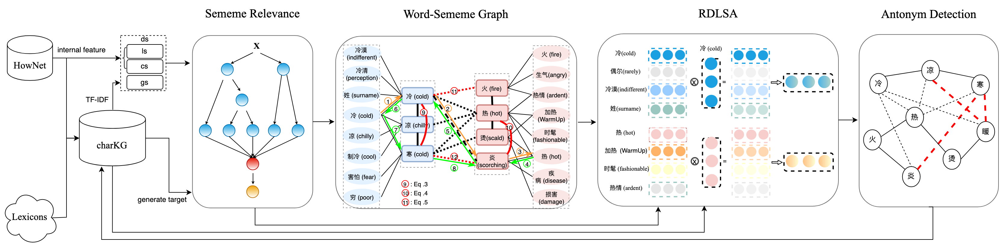

# Word-Sememe Graph-Centric Chinese Antonym Detection

Antonym detection is a vital task in NLP systems. Patternbased methods, typical solutions for this, recognize semantic relationships between words using given patterns but have limited performance. Distributed word embeddings often struggle to distinguish antonyms from synonyms because their representations rely on local co-occurrences in similar contexts. Combining the ambiguity of Chinese and the contradictory nature of antonyms, antonym detection faces unique challenges. In this paper, we propose a word-sememe graph to integrate relationships between sememes and Chinese words, organized as a 4-partite graph. We design a heuristic sememe relevance computation as a supplementary measure and develop a relation inference scheme using related sememes as taxonomic information to leverage the relational transitivity. The 4partite graph can be extended based on this scheme. We introduce the Relation Discriminated Learning based on Sememe Attention (RDLSA) model, employing three attention strategies on sememes to learn flexible entity representations. Antonym relations are detected using a Link Prediction approach with these embeddings. Our method demonstrates superior performance in Triple Classification and Chinese Antonym Detection compared to the baselines. Experimental results show reduced ambiguity and improved antonym detection using linguistic sememes. A quantitative ablation analysis further confirms our scheme’s effectiveness in capturing antonyms.

## Introduction

*Relation Classification* focuses on separating word pairs into synonyms, antonyms, and hypernyms. Among them, **Antonym Detection** is one of the most challenging subtasks and is also a key problem in linguistics which has great significance for knowledge discovery and application to many NLP tasks, such as **Sentiment Analysis**, **Text Entailment**, and **Machine Translation**.

Generally, appearances of words in synonyms and antonyms follow some patterns (e.g., “X or Y” and “X and Y”). Thus, one straightforward way is to extract word pairs according to the given patterns. For example, Lin identified synonyms and antonyms among distributionally large corpus of plain text based on some fixed patterns in English. Nguyen proposed AntSynNET, which encodes simple paths in parse trees using LSTM to train a classifier for antonym detection. However, pattern-based methods are prone to low recall and rely heavily on external resources.

Since words with similar distributions tend to be relevant in meaning, distribution-based methods are becoming popular recently. They can find out target synonyms and antonyms in large corpora and rarely rely on external lexicon resources. Nevertheless, distributed word embeddings based on contextual co-occurrence cannot distinguish between relatedness and similarity because antonyms usually have similar context. Thus, the mining of negative correlations, i.e., antonymous relations, requires a combination of additional knowledge.

Compared with English, the Chinese language has more ambiguity due to its multi-layer structure, rich semantic elements, and evolving consensus senses, which exacerbates ambiguity. Previous works on Chinese **Relation Classification** focused on semantic opposites using Chinese-specific patterns, such as Chinese four-character patterns antonym compounds, universal quantification, and *sizige*. Several works aimed to improve the performance of **Antonym Detection** using more features, external linguistic knowledge bases, or more complex models. However, pattern-based Chinese antonym extraction is limited by outdated and formal corpora, and methods based on Chinese word embeddings also suffer from confusion between relatedness and similarity for detecting antonyms.

To address these problems on Chinese **Antonym Detection**, we introduce sememe to make implicit features explicit and propose a word-sememe layered knowledge graph. It can be modeled as a 4-partite graph which integrates sememes, words, their relations such as synonym and antonym. We extract synonym and antonym triples from linguistic corpora and the Internet resources to instantiate the graph. The relations in the word-sememe graph often carry properties that can improve integrity, such as reflexivity, symmetry, and transitivity. We then design a framework with some schemes for utilizing relational properties.

### Relation Inference
Synonymous and antonymous relations have transitivity and reflexivity properties. So, we develop a *relation inference scheme* with *sememe relevance computation*. The heuristic *sememe relevance computation* method aims to evaluate relevance between sememes based on the synonyms and antonyms of the word-sememe graph. This method can help refine the graph and emphasize the direct connections between sememes. Guided by sememe relevance, *relation inference* that combines the above-mentioned relational properties and supervision from *sememe relevance* can derive more potential and reliable relations by eliminating transitivity paths with ambiguities.

### Relation Discriminated Learning
To model symmetry and discriminate synonyms and antonyms, we also employ a knowledge graph embedding model to encode entities for semantic computation and discovering new antonyms with a distribution-based scheme. Specifically, we utilize three sememe-based attention strategies for building sememe space to obtain semantic separation and disambiguation for entities. By mapping entities vector to the sememe vector space dynamically, we can discriminate similar or opposing features.

### Extensive Experiments
We evaluate our approach on *Triple Classification* and Chinese **Antonym Detection**, and results show our model can effectively distinguish between synonyms and antonyms. As we know, it is the first attempt to detect antonyms using the dynamic embedding with sememes motivated by *Link Prediction* on attributed graph. Experimental results and ablation analysis show that our model can achieve significant performance and exactly capture the underlying antonymous relations.

## Methodology
### Framework
* We have constructed a Chinese word-sememe graph that only includes synonym and antonym relations. 
    * collect & clean basic synonym and antonym triples from：
       *  [Github/Synonyms](https://github.com/chatopera/Synonyms), 
       *  [Github/ChineseAntiword](https://github.com/chatopera/ChineseAntiword),
       *  [Encyclopedia](https://dict.baidu.com/), 
       *  [Wiktionary](https://zh.m.wiktionary.org/wiki/)

* We have built a framework that includes:
    * relation inference
        * sememe relevence
        * relation inference algorithm
    * knowledge representation learning model based on the transitivity, reflexivity, and symmetry of the graph.

#### Installation Requirement

| Package       | Version      |
|---------------|--------------|
| python        | 3.8.5        |
| tqdm          | 4.63.0       |
| sklearn.utils | 0.0          |
| numpy         | 1.18.5       |
| jieba         | 0.42.1       |
| pandas        | 1.3.4        |
| OpenCC        | 1.1.3        |
| tensorflow    | 1.15.0       |
| keras         | 2.3.1        |
| Levenshtein     | 0.12.2       |
| OpenHowNet      | 2.0          |
| jieba           | 0.42.1       |
| jieba.analyse   | 0.1.0        |
| jieba.posseg    | 0.1.0        |
|xgboost          |1.7.4         |

#### Hyper-parameters and Training Setting.
We unify all representations in a `300`-dimensional space, use a margin parameter `γ` of `0.2`,
and initialize character and sememe vectors with existing character embeddings.
We optimize embeddings using `Adaptive Moment Estimation (Adam)` with a learning rate of `10e−6` . 
For baselines, we adopt their best-performing configurations. 
We set `δ` as `3:1` after maximizing prediction accuracy in the validation set.

#### Chinese word-sememe graph

* Word-Semem Graph (i.e., 4-partite graph)

    * use `getAllWord_Sememe()` in testOpenHowNet.py
    * The `getAllWord_Sememe()` function also can take a parameter: word, to get the sememes of this word. 
    * It returns word2Sememe which is a dictionary with words as keys and their corresponding sememes as values.
    * Finally, the function writes the results to four separate files: `data/word2Sense.txt, data/word2Sememe.txt, data/sense2Sememe.txt, and data/sememe2Word.txt`.
* Character SynonymsAntonyms Knowledge Graph (namely, charKG)

    just run `python constructKG.py` to construct the charKG for train and test.
    * The code performs several pre-processing steps on a dataset containing network synonyms and antonyms. 
        * Firstly, synonyms and antonyms with a length greater than one are removed. 
        * Then, entities that do not appear in the training set are replaced in the test and validation sets. 
        * The data is divided into training, test, and validation sets. Further, the code computes various statistics on the sense and sememe counts of the entities in the dataset. 
        * Finally, the results are stored in various files, including entity2id.txt, relation2id.txt, entityWords.txt, entitySenses.txt, and word2id.txt.
    The code uses Python's random and copy modules and imports functions from testOpenHowNet and tqdm.

* HanDian
    * we choose [Zdic](https://www.zdic.net/) as a complementary test dataset source in closed-world scenarios (named HanDian).
    * We eliminate the triples repeated with the training set and get 132 test antonym triples.
    * The data processing method comes from another unpublished paper, so only the results are provided, not the processing method.

#### Sememe relevance computation
* First, use `generateSememeRandomSet.py` to generate the negetive smaples against the train.txt, i.e, gold triples.
* Then, use the `calNegTriples()` function in `Triple_Discovery.py` to generate suitable dataset for train xgboost. look the definition for var `is_used_to_discover_triples`
* Finally, run command `python xgboost_sememe_relevance.py` for train xgboost. (this is not necessary, it is running automatically in next step)

#### Relation inference scheme
* run the `ExpandDataset()` function in `Triple_Discovery.py` to generate new triples with the xgboost predictor (sememe relvence).

#### Relation Discriminated Learning based on Sememe Attention (RDLSA)
 * Parameter Annotation 
     * lossf: str - Loss function type, default is 'mae'  
     * ite: int - Number of training iterations, default is 1000 
     * lr: float - Learning rate, default is 0.0005 
     * ATTENTION_SCHEMA: int - Attention schema type, default is 0(CS), left is 2(Avg), 6(SS)

 * Following command is a example command for runing RDLSA:
> python TrainAntonymAttention.py mae 500 0.000001 0

## Results
Following command is a example command for evaluating RDLSA's embedding for **Link Prediction** and **Antonym Detection**:
> python Evaluation.py 1 entityVector_0.txt

Internet-Dict Method can run with the following command: 
> python baiducidianMethod.py

Our approach has been evaluated through experimental results on Triple Classification and Antonym Detection. 

|              |          charKG          |          |          |         |           |           |          HanDian         |          |          |          |         |           |           |
|--------------|:-----------------------:|:--------:|:--------:|:-------:|:---------:|:---------:|:------------------------:|:--------:|:--------:|:--------:|:-------:|:---------:|:---------:|
|              | hit@1 | hit@3 | hit@10 |   MRR   |    MR     |   TC (%)  | hit@1 | hit@3 | hit@10 |   MRR   |    MR     |  TC (%)   |
|--------------|:-----:|:-----:|:------:|:-------:|:---------:|:---------:|:-----:|:-----:|:------:|:-------:|:---------:|:---------:|
| Word2vec     |   -   |   -   |   -    |  0.0006 |    4191   |   18.50   |   -   |   -   |   -    |  0.0003 |    4317   |    9.09   |
| TransE       |   -   | 0.083 | 0.1574 |  0.0568 |    668    |   62.03   |   -   | 0.170 | 0.2689 |  0.109  |    298    |   79.55   |
| TransH       |   -   | 0.055 | 0.0741 |  0.025  |    1558   |   61.11   |   -   | 0.034 | 0.0758 |  0.028  |    1247   |   62.12   |
| TransR       |   -   | 0.055 | 0.0926 |  0.0384 |    1629   |   61.11   |   -   | 0.454 | 0.6098 |  0.243  |    526    |   78.79   |
| TransD       |   -   | 0.046 | 0.1296 |  0.0404 |    1898   |   57.41   |   -   | 0.140 | 0.3409 |  0.1085 |    686    |   74.62   |
| RESCAL       | 0.027 | 0.046 | 0.0556 |  0.0395 |    1859   |   55.56   | 0.034 | 0.053 | 0.0682 |  0.049  |    1419   |   63.64   |
| DistMult     | 0.055 | 0.111 | 0.2407 |  0.1129 |    1079   |   68.52   | 0.560 | 0.651 | 0.6931 |  0.6149 |    369    |   81.81   |
| ComplEx           |      0.0463    |     0.0741     |     0.1296    |     0.0745  |   1243     |     62.04            |     0.5379     |     0.6174     |     0.6364    |   0.5809    |   471      |    80.30         |
| RotatE            |      0.0463    |     0.1667     |  **0.2963**   |     0.1279  |    613     |     70.37            |     0.4962     |     0.6402     |     0.6856    |   0.5766    |   288      |    79.55         |
| RoBERTa           |        -       |       -        |       -       |     0.064   |    656     |     70.4             |     0.0227     |     0.0455     |     0.0909    |   0.0514    |   356      |    85.6          |
| Internet-Dict     |        -       |       -        |       -       |       -     |     -      |     59.26            |        -       |       -        |       -       |      -      |     -      |    80.30         |
| ----------------- | --------------|---------------|---------------|-------------|------------|----------------------|----------------|----------------|---------------|-------------|------------|-----------------|
| **RDLSA (Avg)**   |  **0.1019**    |  **0.1481**    |     0.2593    |  **0.1458** |    389     |  **90.74**           |     0.2424     |     0.3409     |     0.4242    |   0.3071    |   243      |  **94.72**       |
| **RDLSA (CS)**    |      0.0926    |     0.1296     |     0.2222    |     0.1388  |    388     |     90.74            |     0.2462     |     0.3333     |     0.4205    |   0.3105    |   235      |    95.62         |
| **RDLSA (SS)**    |      0.0926    |     0.1574     |     0.25      |  **0.1458** |  **364**   |  **91.32**           |     0.2654     |     0.3674     |     0.4583    |   03345     |  **189**   |  **96.34**       |

# Authors and Copyright

RDLSA is developed in National Engineering Research Center for Big Data Technology and System, Cluster and Grid Computing Lab, Services Computing Technology and System Lab, School of Computer Science and Technology, Huazhong University of Science and Technology, Wuhan, China by Zhaobo Zhang (zhang\_zb@hust.edu.cn), Pingpeng Yuan (ppyuan@hust.edu.cn), Hai Jin (hjin@hust.edu.cn).

Copyright (C) 2023, [STCS & CGCL](http://grid.hust.edu.cn/) and [Huazhong University of Science and Technology](http://www.hust.edu.cn).

Licensed under the Apache License, Version 2.0 (the "License");
you may not use this file except in compliance with the License.
You may obtain a copy of the License at

      http://www.apache.org/licenses/LICENSE-2.0

Unless required by applicable law or agreed to in writing, software
distributed under the License is distributed on an "AS IS" BASIS,
WITHOUT WARRANTIES OR CONDITIONS OF ANY KIND, either express or implied.
See the License for the specific language governing permissions and
limitations under the License.

